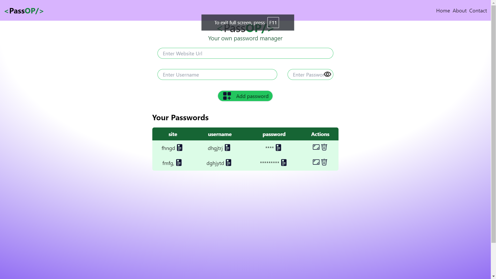
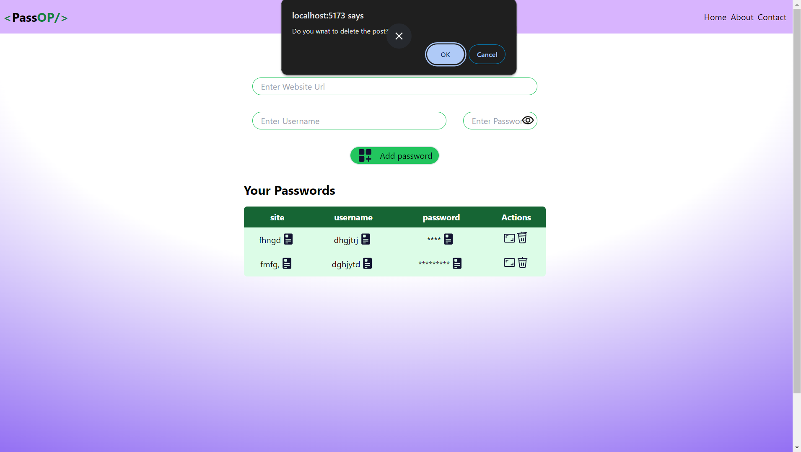
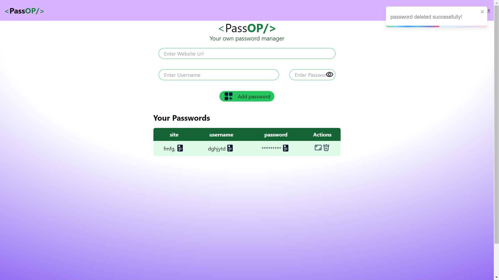

# Password Manager Website
## Overview
This project is a simple password manager website that allows users to securely store, update, delete, and view passwords associated with different website accounts. It provides a user-friendly interface to manage login credentials efficiently.

## Features
Add Passwords: Save username, password, and site name.
View Passwords: Display saved passwords.
Update Passwords: Modify existing username, password, and site name.
Delete Passwords: Remove saved credentials.
Technologies Used
Frontend: HTML, CSS, JavaScript
Backend: Node.js, Express.js
Database: MongoDB
Security: bcrypt for hashing passwords

### Installation
##### Clone the repository:

Clone the repo
`cd password-manager`
##### Install dependencies:

`npm install`
##### Set up environment variables:
##### Create a .env file in the root directory and add the following:

`MONGODB_URI=your_mongodb_connection_string
SECRET_KEY=your_secret_key_for_jwt
Run the application:`

##### Start the server

`npm start`

## Usage

